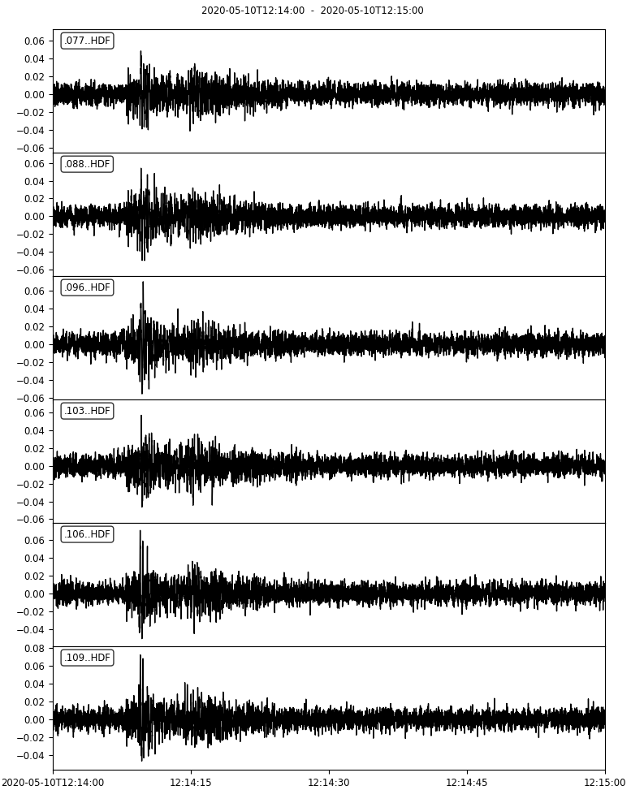

# Summary

Infrasound (low-frequency pressure waves in air) is widely used as a geophysical method for monitoring powerful, often hazardous processes like volcanic explosions, nuclear tests, bolides, avalanches, mudflows, and earthquakes. Infrasound can also be used to monitor changes in atmospheric wind fields, and balloon-borne infrasound has been proposed as a means of seismic monitoring on planets like Venus where ground-based monitoring is impractical. In infrasound research campaigns, signals are typically recorded to disks in by unsupervised, non-telemetered instruments, and recordings must be converted to standard data formats before analysis and distribution. The "gemlog" package handles data conversion and facilitates data analysis for an open-source instrument, the Gem Infrasound Logger.

# Statement of need
The Gem Infrasound Logger [@Anderson2018] is an approach to infrasound recording where the sensor and data logger are built into a single cable-free package that is easy to conceal and permits arbitrary sensor network geometries. Additionally, it is optimized for low cost, long battery life with small batteries, light weight, and simple, fast installation. These characteristics make it a good choice for temporary infrasound campaigns. By contrast, most campaigns that do not use the Gem use analog infrasound sensors that, via long cables, connect to multichannel data loggers built to record seismometers. This approach yields high-quality data but has several disadvantages: seismic data loggers are expensive, and sensor cables constrain the sensor network's geometry, make a station prone to animal damage and vandalism due to their visibility and exposure, and account for a large share of a recording site's budget for weight, bulk, and setup time. These disadvantages are especially acute for temporary recording campaigns (as opposed to permanent installations), which account for a large share of infrasound research.

Like many geophysical data loggers, the Gem writes data in a non-standard raw format intended to balance firmware simplicity and performance, human readability, and compact file size. Although it is a human-readable text format that an expert can read and understand on a line-by-line basis, data files consist of hundreds of thousands of lines with complicated formatting, meaning that reading it as a spreadsheet or data frame is impractical. Further, operations like clock drift corrections, data decompression, and conversion to standard file formats or classes must be performed to make the data accessible in standard visualization and analysis software. Users often need to convert data from 10 or more infrasound loggers spanning several weeks, meaning that thousands of files including billions of data points must be processed efficiently. The "gemlog" Python package (GPL-3 license, installable from PyPI) is a cross-platform tool to facilitate data conversion, is essential for all Gem infrasound logger users.

# Applications
The Gem Infrasound Logger (including "gemlog") has been included in independent evaluations of infrasound instruments [@SladMerchant2021, @Kramer2021], and has been used in several past and upcoming publications, including the following:

- Volcano monitoring [@Mock2020; @Bosa2021; @Rosenblatt2022]

- Monitoring atmospheric changes using infrasound [@Averbuch2022; @Dannemann2022]

- Infrasound monitoring from high-altitude balloons [@BowmanAlbert2018; @Young2018; @Bowman2020; @Krishnamoorthy2020; @Brissaud2021]

- River rapid infrasound monitoring [@Ronan2017; @Gauvain2021]

- Remotely monitoring earthquake ground shaking [@Anderson_inprep]

# Features
"gemlog" is a Python library that includes both terminal commands and Python functions.
- Data conversion: Terminal commands "gemconvert" and "gemconvert_single" convert sets of raw files into standard data formats (typically miniSEED). Because infrasound analyses require sample timing to be approximately millisecond-precise, an essential part of this process is correcting clock drift using accurate times provided infrequently by the Gem's on-board GPS. Contiguous blocks of raw data are converted into contiguous blocks of output data, and the software identifies breaks in recording and includes the same breaks in the output.

- Instrument testing: Terminal command "verify_huddle_test" is used to automatically examine waveform, state-of-health, and GPS data from several instruments recording in the same place at the same time (termed a "huddle test" in seismology/infrasound), and verify that all instruments are working properly.

- Data analysis and visualization in Python: several Python functions facilitate working with data, including plotting spectra of the Gem's self-noise and standard environmental noise specs set by the International Monitoring System, and deconvolving the Gem's instrument response from recordings. "gemlog" is well-integrated with the common seismic/infrasound data processing Python package "obspy" [@obspy] and uses its functions and classes when possible.

# Demonstrations
"gemlog" includes three demonstrations of its functionality, including example data, example code, and explanations. These demonstrations cover the most common uses of "gemlog".

- A typical data conversion, pre-processing, and inspection workflow, including using obspy tools to process and plot data and metadata (figure \autoref{fig:example}).

- Data conversion workflows that can be used for data lacking GPS data (typically recorded at high-altitude, indoors, or underground) in which normal timing corrections are impossible.

- A quality-control workflow to inspect an infrasound dataset assumed to come from multiple instruments recording simultaneously in the same location, verifying that all instruments appear to work correctly and record the same data.

# Acknowledgements
This work was funded by NSF award EAR-2122188. 

# References